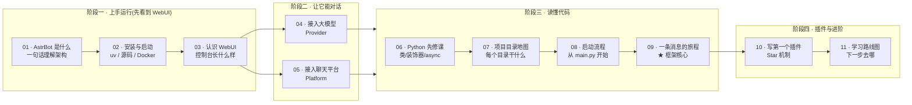

# 📚 AstrBot 学习路径

> 这套笔记帮你**从零把 AstrBot 跑起来、配好、用起来,再一步步看懂它的源码**。
> 预设前提:你只掌握了 Python 最基本语法(变量/循环/函数/列表/字典),还没系统学过面向对象和异步。

## 这套笔记是什么

| 项目 | 说明 |
|---|---|
| 面向对象 | Python 入门者 / 想研究一个真实开源项目的人 |
| 学习目标 | ① 成功运行 AstrBot ② 接入大模型和聊天平台 ③ 看懂核心代码怎么流转 ④ 尝试写插件 |
| 配套源码 | 本笔记位于 `github_project/Astrbot_study/`;所分析代码在其**同级**目录 `github_project/AstrBot-master/`(即你下载的源码) |
| 阅读方式 | 建议**按顺序**阅读。每个阶段约 1~3 天,根据自己的节奏来 |

## 🗺️ 可视化学习路线



> 如果你的 Markdown 编辑器不支持 Mermaid,看下面的文字版路线:

```
阶段一(上手运行): 01 AstrBot是什么 ──▶ 02 安装与启动 ──▶ 03 认识WebUI
阶段二(配置机器人): 04 接入大模型 ──▶ 05 接入聊天平台
阶段三(读懂代码):   06 Python先修课 ──▶ 07 目录地图 ──▶ 08 启动流程 ──▶ 09 一条消息的旅程
阶段四(插件进阶):   10 写第一个插件 ──▶ 11 学习路线图
附录:               12 词汇表  13 常见问题与排错(随时查)
```

## 📂 笔记目录与学习产出

| 顺序 | 笔记 | 学完你就能…… | 建议用时 |
|---|---|---|---|
| 01 | [01-AstrBot是什么](01-上手运行/01-AstrBot是什么.md) | 用 3 句话跟别人讲清 AstrBot 是什么 | 30 分钟 |
| 02 | [02-安装与启动](01-上手运行/02-安装与启动.md) | 在电脑上把 AstrBot 跑起来,打开 WebUI | 1~2 小时 |
| 03 | [03-认识WebUI控制台](01-上手运行/03-认识WebUI控制台.md) | 熟悉控制台各页面,知道去哪配东西 | 1 小时 |
| 04 | [04-接入大模型](02-配置机器人/04-接入大模型.md) | 给机器人接上真正的 AI 大脑 | 1 小时 |
| 05 | [05-接入聊天平台](02-配置机器人/05-接入聊天平台.md) | 在 QQ/Telegram 等平台和机器人对话 | 1~2 小时 |
| 06 | [06-Python先修课](03-读懂代码/06-Python先修课.md) | 看懂源码里最常见的 Python 写法 | 半天 |
| 07 | [07-项目目录地图](03-读懂代码/07-项目目录地图.md) | 拿到任何文件都知道它大概负责什么 | 1 小时 |
| 08 | [08-启动流程](03-读懂代码/08-启动流程.md) | 说清从 `main.py` 到框架启动经历了什么 | 1~2 小时 |
| 09 | [09-一条消息的旅程](03-读懂代码/09-一条消息的旅程.md) | 讲清"消息进来到回复出去"的完整链路 | 2~3 小时 |
| 10 | [10-写第一个插件](04-插件与进阶/10-写第一个插件.md) | 写一个能响应指令的 AstrBot 插件 | 半天 |
| 11 | [11-学习路线图与资源](04-插件与进阶/11-学习路线图与资源.md) | 知道自己接下来该学什么、去哪找资料 | 30 分钟 |
| 12 | [12-词汇表](05-附录/12-词汇表.md) | 遇到术语不慌,随时查 | 随用随查 |
| 13 | [13-常见问题与排错](05-附录/13-常见问题与排错.md) | 自己解决大部分启动/连接报错 | 随用随查 |

## 🧭 使用建议

1. **先别跳读**。阶段一、二是"把它用起来",有了真实运行中的程序,阶段三读代码才有画面感。
2. **边读边做**。每篇末尾都有「小练习」,尤其阶段一/二,请真的在终端里敲一遍命令。
3. **报错了先看 FAQ**。附录 13 汇总了新手最高频的错误。
4. **笔记里的路径**如 `astrbot/core/initial_loader.py`,都以源码目录 **`github_project/AstrBot-master/`** 为根(本文件夹与它同级)。文中凡写 `AstrBot-master/xxx` 的地方,请到同级源码目录里找对应文件。建议用 VS Code **同时打开这两个文件夹**(`github_project/AstrBot-master` 和 `github_project/Astrbot_study`)对照着看。
5. 这套笔记基于这份源码(版本见同级 `AstrBot-master/pyproject.toml`,当前为 **v4.28.0-beta.1**,要求 Python ≥ 3.12)。

## ✅ 完成打卡

每完成一个阶段,给自己打个勾:

- [ ] 阶段一:WebUI 能打开,能看到登录页
- [ ] 阶段二:在聊天软件里,机器人能正常回复你
- [ ] 阶段三:能不看笔记,自己画出"一条消息的旅程"流程图
- [ ] 阶段四:写出了一个自定义指令插件并加载成功

> 遇到卡住的地方,欢迎回来问我;也欢迎把你在源码里发现的"学习路线图(11)之外"的好问题记下来。
